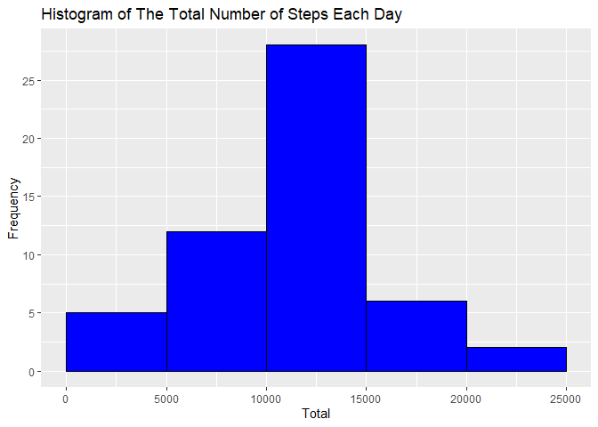
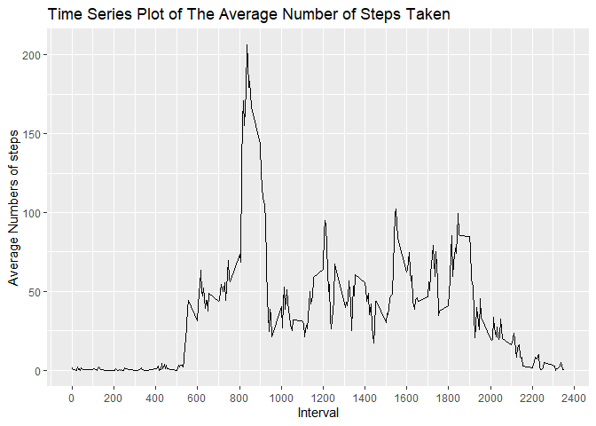
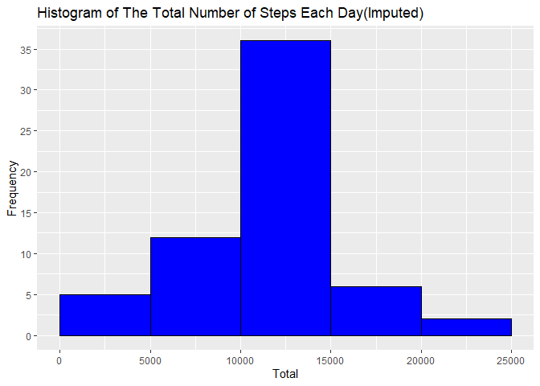
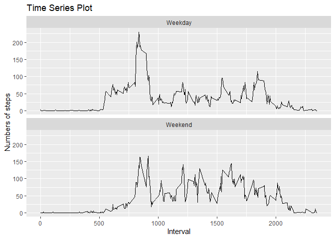

\#Add The Packages Add the packages needed in this projcet

    library(tidyverse)

    ## -- Attaching packages ------------------------------------------------------------------------------------------------------------------------------------ tidyverse 1.3.0 --

    ## v ggplot2 3.3.2     v purrr   0.3.4
    ## v tibble  3.0.3     v dplyr   1.0.1
    ## v tidyr   1.1.1     v stringr 1.4.0
    ## v readr   1.3.1     v forcats 0.5.0

    ## -- Conflicts --------------------------------------------------------------------------------------------------------------------------------------- tidyverse_conflicts() --
    ## x dplyr::filter() masks stats::filter()
    ## x dplyr::lag()    masks stats::lag()

    library(dplyr)
    library(knitr)
    library(ggplot2)

\#Read The Data The file can be download from link in the this link
[Activity
Data](https://raw.githubusercontent.com/devarafathan/RepData_PeerAssessment1/master/activity.zip)

    getwd()

    ## [1] "E:/BELAJAR CODING/R/COURSERA/RepData_PeerAssessment1"

    url <- 'https://raw.githubusercontent.com/devarafathan/RepData_PeerAssessment1/master/activity.zip'
    dest <- download.file(url, 'E:/BELAJAR CODING/R/COURSERA/RepData_PeerAssessment1/activity.zip')
    unzip('activity.zip')
    activity <- read.csv('activity.csv')

\#Process The Data The first data that required on this project is data
without imputing. Therefore, we have to igonore NA values in the
acitvity dataset. Here are the code  
for cleaning up and processing the dataset.

    activity_clean <- activity %>% filter(steps != 'NA')
    head(activity_clean)

    ##   steps       date interval
    ## 1     0 2012-10-02        0
    ## 2     0 2012-10-02        5
    ## 3     0 2012-10-02       10
    ## 4     0 2012-10-02       15
    ## 5     0 2012-10-02       20
    ## 6     0 2012-10-02       25

Then we can grouped the data based on the date and then summarize it to
take the sum value for each day.

    activity_clean$date <- as.factor(activity_clean$date)
    activity_histogram <- activity_clean %>% group_by(date) %>% summarize(total= sum(steps))

    ## `summarise()` ungrouping output (override with `.groups` argument)

    head(activity_histogram, 10)

    ## # A tibble: 10 x 2
    ##    date       total
    ##    <fct>      <int>
    ##  1 2012-10-02   126
    ##  2 2012-10-03 11352
    ##  3 2012-10-04 12116
    ##  4 2012-10-05 13294
    ##  5 2012-10-06 15420
    ##  6 2012-10-07 11015
    ##  7 2012-10-09 12811
    ##  8 2012-10-10  9900
    ##  9 2012-10-11 10304
    ## 10 2012-10-12 17382

\#Histogram of The Total Number of Steps Taken Each Day We will use
ggplot function to plot the histogram of the total number of steps taken
each day.

    activity_histogram %>% ggplot(aes(total)) +
          geom_histogram(binwidth = 5000, center= 2500, fill='blue', col='black') + 
          scale_x_continuous(breaks = seq(0, 25000, 5000)) +
          scale_y_continuous(breaks= seq(0,30, 5)) +
          ggtitle('Histogram of The Total Number of Steps Each Day') +
          xlab('Total') + 
          ylab('Frequency')

\#Mean And Median Number of Steps Taken Each Day Calculate the Mean and
Median Number using the group\_by() and summarize() function.

    activity_mean_median <- activity_clean %>% group_by(date) %>% summarize(mean=mean(steps), median=median(steps))

    ## `summarise()` ungrouping output (override with `.groups` argument)

    activity_mean_median

    ## # A tibble: 53 x 3
    ##    date         mean median
    ##    <fct>       <dbl>  <dbl>
    ##  1 2012-10-02  0.438      0
    ##  2 2012-10-03 39.4        0
    ##  3 2012-10-04 42.1        0
    ##  4 2012-10-05 46.2        0
    ##  5 2012-10-06 53.5        0
    ##  6 2012-10-07 38.2        0
    ##  7 2012-10-09 44.5        0
    ##  8 2012-10-10 34.4        0
    ##  9 2012-10-11 35.8        0
    ## 10 2012-10-12 60.4        0
    ## # ... with 43 more rows

\#Time Series Plot of The Average Number of Steps Taken First, we have
to group the activity\_clean dataset based on the interval and summarize
the mean for each interval. Save the last table to a variable named
activity\_series.

    activity_series <- activity_clean %>% group_by(interval) %>% summarize(average= mean(steps))

    ## `summarise()` ungrouping output (override with `.groups` argument)

    head(activity_series, 10)

    ## # A tibble: 10 x 2
    ##    interval average
    ##       <int>   <dbl>
    ##  1        0  1.72  
    ##  2        5  0.340 
    ##  3       10  0.132 
    ##  4       15  0.151 
    ##  5       20  0.0755
    ##  6       25  2.09  
    ##  7       30  0.528 
    ##  8       35  0.868 
    ##  9       40  0     
    ## 10       45  1.47

Then just plot the time series plot using activity\_series dataset.

    activity_series %>% ggplot(aes(interval, average)) + 
          geom_line() + 
          scale_x_continuous(breaks = seq(0, 2500, 200)) +
          ggtitle('Time Series Plot of The Average Number of Steps Taken') +
          xlab('Interval') + 
          ylab('Average Numbers of steps')

\#The 5-minute interval that, on average, contains the maximum number of
steps Find the maximum interval that have the maximum number of steps.

    index_max <- which.max(activity_series$average)
    activity_series[index_max,]

    ## # A tibble: 1 x 2
    ##   interval average
    ##      <int>   <dbl>
    ## 1      835    206.

**The maximum average step is at interval 835 with 206.1698 value**

\#Code to describe and show a strategy for imputing missing data Note
that there are a number of days/intervals where there are missing values
(coded as NA). The presence of missing days may introduce bias into some
calculations or summaries of the data.

1.  Calculate and report the total number of missing values in the
    dataset (i.e. the total number of rows with NAs)
2.  Devise a strategy for filling in all of the missing values in the
    dataset. The strategy does not need to be sophisticated. For
    example, you could use the mean/median for that day, or the mean for
    that 5-minute interval, etc.
3.  Create a new dataset that is equal to the original dataset but with
    the missing data filled in.
4.  Make a histogram of the total number of steps taken each day and
    Calculate and report the mean and median total number of steps taken
    per day. Do these values differ from the estimates from the first
    part of the assignment? What is the impact of imputing missing data
    on the estimates of the total daily number of steps?

In this project i choose the strategy to fill the NA steps value using
the average interval value. Here is the code:

    activity_imputed <- activity
    for (i in 1:nrow(activity_imputed)) {
          if(is.na(activity_imputed$steps[i])){
                inter <- activity_imputed$interval[i]
                average <- activity_series$average[which(activity_series$interval==inter)]
                activity_imputed$steps[i] <- average
          }
    }
    head(activity_imputed, 10)

    ##        steps       date interval
    ## 1  1.7169811 2012-10-01        0
    ## 2  0.3396226 2012-10-01        5
    ## 3  0.1320755 2012-10-01       10
    ## 4  0.1509434 2012-10-01       15
    ## 5  0.0754717 2012-10-01       20
    ## 6  2.0943396 2012-10-01       25
    ## 7  0.5283019 2012-10-01       30
    ## 8  0.8679245 2012-10-01       35
    ## 9  0.0000000 2012-10-01       40
    ## 10 1.4716981 2012-10-01       45

\#Histogram of The Total Number of Steps Taken Each Day After Missing
Values are Imputed Make a histogram after filling the NA value, so we
use activity\_imputed dataset. We have to group the date and the
summarize the total steps of each day

    #group and summarize
    activity_histogram2 <- activity_imputed %>% group_by(date) %>% summarize(total=sum(steps))

    ## `summarise()` ungrouping output (override with `.groups` argument)

    #plot the histogram
    activity_histogram2 %>% ggplot(aes(total)) +
          geom_histogram(binwidth = 5000, center= 2500, fill='blue', col='black') + 
          scale_x_continuous(breaks = seq(0, 25000, 5000)) +
          scale_y_continuous(breaks= seq(0,40, 5)) +
          ggtitle('Histogram of The Total Number of Steps Each Day(Imputed)') +
          xlab('Total') + 
          ylab('Frequency')

After imputing the data, we can compare the data before and after
computing using median and mean value

    #Mean before imputing
    mean(activity_histogram$total)

    ## [1] 10766.19

    #mean after imputing
    mean(activity_histogram2$total)

    ## [1] 10766.19

    #median before imputing
    median(activity_histogram$total)

    ## [1] 10765

    #median after imputing
    median(activity_histogram2$total)

    ## [1] 10766.19

\#Panel Plot Comparing The Average Number of Steps Taken per 5-minute
Interval Across Weekdays and Weekends For this part the weekdays()
function may be of some help here. Use the dataset with the filled-in
missing values for this part.

\#\#Create New Variable Vector Create a new factor variable in the
dataset with two levels – “weekday” and “weekend” indicating whether a
given date is a weekday or weekend day.

    #Convert column date into class of date variable.
    activity_imputed$date <- weekdays(as.Date(activity_imputed$date))
    weekend_name <- c('Saturday', 'Sunday')
    weekday_name <- c('Monday', 'Tuesday', 'Wednesday', 'Thursday', 'Friday')
    activity_imputed <- activity_imputed %>% mutate(typeday= ifelse(date %in% weekday_name, 'Weekday','Weekend'))
    head(activity_imputed)

    ##       steps   date interval typeday
    ## 1 1.7169811 Monday        0 Weekday
    ## 2 0.3396226 Monday        5 Weekday
    ## 3 0.1320755 Monday       10 Weekday
    ## 4 0.1509434 Monday       15 Weekday
    ## 5 0.0754717 Monday       20 Weekday
    ## 6 2.0943396 Monday       25 Weekday

\#\#Create The Plot

    activity_week <- activity_imputed %>% group_by(typeday, interval) %>% summarize(mean=mean(steps)) 

    ## `summarise()` regrouping output by 'typeday' (override with `.groups` argument)

    activity_week %>% ggplot(aes(interval, mean)) + 
          geom_line() + 
          scale_x_continuous(breaks = seq(0, 2500, 500)) +
          ggtitle('Time Series Plot') +
          xlab('Interval') + 
          ylab('Numbers of steps') +
          facet_wrap(.~typeday, ncol = 1)

